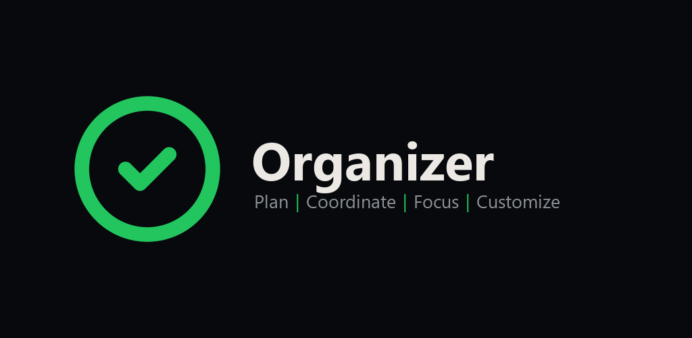
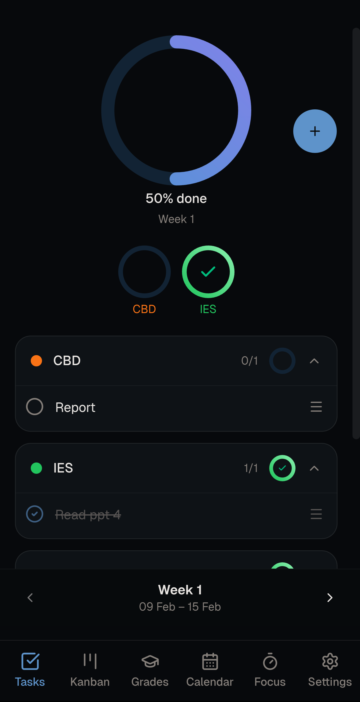
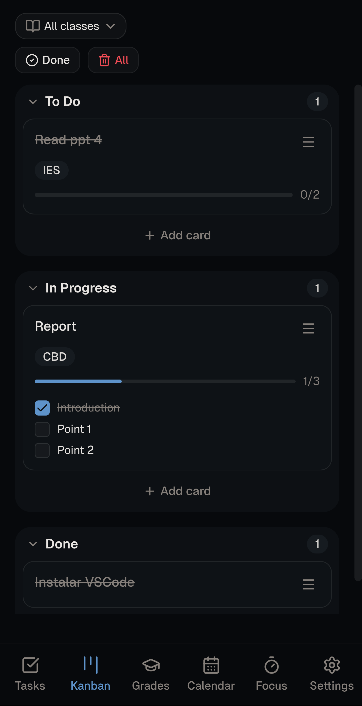
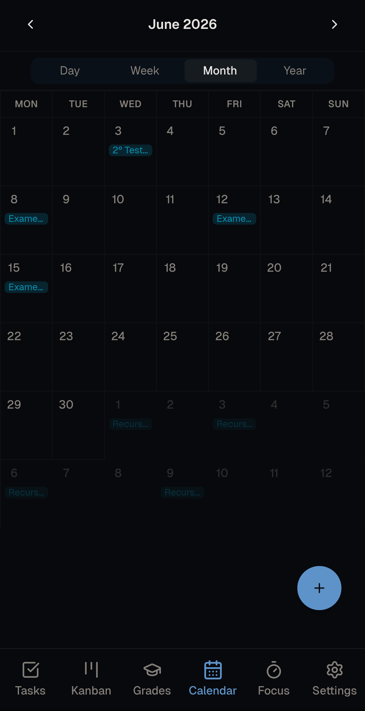
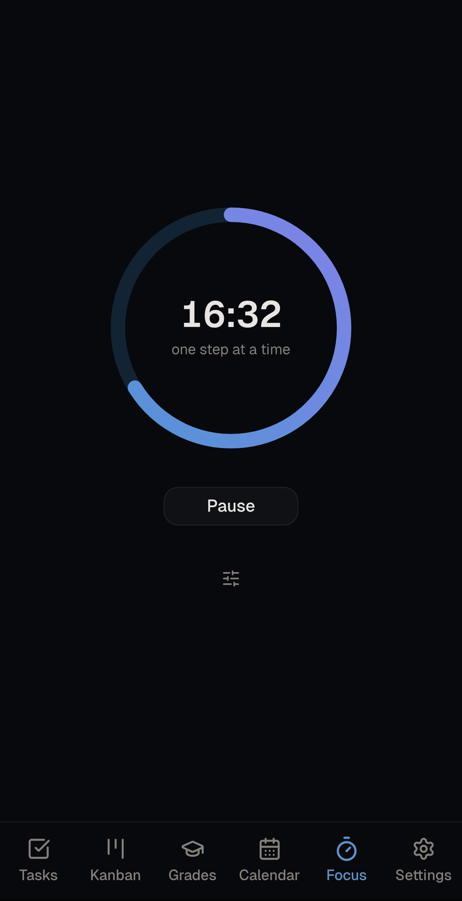
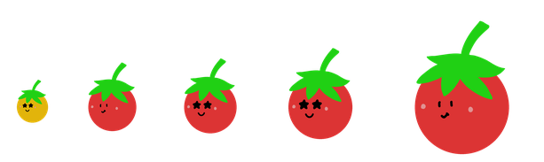

<p align="center">
  
</p>

<p align="center">
  A local-first academic planner for students.<br>
  Plan your semester, manage tasks, track grades, keep notes, and run focus sessions.<br>
  No cloud account required, no paywalls.
</p>

<p align="center">
  <a href="https://play.google.com/store/apps/details?id=io.github.f4rsantos.organizer"><strong>Google Play</strong></a>
  &nbsp;·&nbsp;
  <a href="https://f4rsantos.github.io/organizer/"><strong>Open in browser</strong></a>
</p>

---

## Goal

Organizer exists to reduce academic overload. It keeps study planning, deadlines, grade tracking, notes, and focus sessions in one place so students can decide faster and work with less friction.

There is no server. Your data sits in your browser. Firebase sync and team collaboration are opt-in, and they run on a Firebase project you create and own.

It runs in the browser as a PWA and on Android as a native app with home screen widgets.

<p align="center">
  
  
  
  
</p>

## Features

- Semester planning with dates, holidays, and class setup
- Tasks one week at a time, grouped by class, each with a progress ring
- Recurring tasks with daily, weekly, and monthly intervals and an end date
- Calendar with day, week, month, and year views, and drag on the hour grid to block out time
- Kanban board with custom columns and checklists
- Grade tracking with weighted components, splittable into parts, and a panel telling you what you still need
- Notes with a rich text editor, nested folders, and an inline maths solver
- Focus timer with interval or scheduled breaks, and optional pomodoro stats
- Weather forecast on calendar views, no API key needed
- Optional apps you turn on individually: habits, Eisenhower matrix, standby display, quick actions, and more
- Android home screen widgets for tasks, agenda, kanban, goals, pomodoro, and a summary
- Eight interface languages
- Work mode that hides grades and renames classes to groups
- No-semester mode that organises by plain calendar week
- End-to-end encryption for local storage, sync, and backups
- In-app guided walkthroughs for some of the bigger features

## Apps

Extra features ship as apps you enable one at a time in settings. Anything you leave off stays out of the navbar and out of your way. Turning an app off permanently deletes the data it owns.

| App | What it does |
|---|---|
| **Notes** | Rich text editor with headings, tables, code blocks, checklists, quotes, links, text colour and size, and undo/redo. Nested folders, list or mosaic layout, starred notes, archive, and search. Type `@` to link a task by name. Imports Markdown and plain text; exports Markdown, plain text, web page, Word, or print to PDF. An optional maths solver handles equations, inequalities and quadratics, plots graphs, and can show its working. Handwriting canvas notes need cloud sync, since drawings are stored remotely. |
| **Habits** | Check-in button with cadences from daily to monthly or custom weekdays, rest days, a streak count and history calendar, optional check-in notes, finish lines by count or date, and five encouragement tones |
| **Eisenhower matrix** | Sort tasks by urgency and importance across four customizable quadrants, with drag and drop |
| **Standby** | Turning the phone to landscape opens a desk display on its own and keeps the screen awake. One to three panels showing a clock wheel, the time, calendar, focus timer, kanban, or tasks by category, each with an optional smaller pane underneath |
| **Quick actions** | Spotlight overlay for creating and editing by typing or speaking. Open it from the navbar, a keyboard shortcut, or a triple tap |
| **Pomodoro** | Grow tomatoes during focus sessions, with stats, streaks, monthly trends, and reset periods |
| **Google Calendar** | Two-way sync with your primary Google Calendar, using your own OAuth client |
| **EI calendar** | Official EI course calendar for your year, read-only |
| **Collaboration** | Shared teams, described below |

Apps are self-contained modules under `src/apps/`. Adding one means dropping in a folder, adding strings, and registering it. See [`src/apps/README.md`](src/apps/README.md).

### Quick actions

Commands are parsed for dates, times, durations, classes, priorities, recurrence, and kanban columns. Several can be chained in one line, and small typos are tolerated.

```
add task essay for calculus tomorrow at 3pm
add task gym every monday high priority
add calendar event lecture 15h-17h
add tasks alpha, beta, gamma
add note ideas
grade 15 in midterm for calculus
add component final to calculus weight 30%
start focus 20m 5m break
complete goal gym
delete groceries
open settings
```

This works in every supported language, not only English.

## Customization

Organizer is built to be tailored to your needs, not just used as-is.

**Structure**
- Multiple semesters with per-semester class sets
- Semester dates and holidays
- Course presets that seed classes, tasks, and grade components
- Schedule import that scans a timetable screenshot, reading day and time from the grid layout
- End-of-semester transition that carries over the kanban cards, tasks, and events you choose

**Tasks**
- Week span behavior for multi-week tasks: one global checkbox or per-week
- Separate due date and week range, so a task can sit on the calendar on one date while appearing across the weeks you are working on it
- Type a title like "essay calculus tomorrow" and the class and due date fill themselves in, without overwriting anything you set yourself
- Recurrence rules with an interval and an end date, each occurrence ticked off separately
- Optional calendar visibility per task, with optional start and end times
- Reminder lead times you configure in days before the due date, at a time you set
- Option to tuck finished tasks into a collapsible Completed section

**Kanban**
- Add, rename, reorder, and remove columns
- Per-card priority, due date, class, and checklist
- Checklist previews on all cards, no cards, or case by case, set per card in the card dialog
- Push a card into the weekly Tasks list, or auto-add the week's tasks to the board
- Filter by team, assignee, or class, with optional dividers

**Grades**
- Per-class grading components and weights, with the total flagged until it reaches 100%
- Components splittable into parts when one is graded across several pieces, with the weight divided between them
- A panel that works out what you need on everything still ungraded to hit your target, and says so plainly when the target is out of reach
- Credit-weighted semester average and the credits you are on track to pass
- Previous semester values and a course average projection
- Configurable grade scale and passing grade

**Focus and Pomodoro**
- Interval breaks and breaks scheduled at fixed times of day, usable together or separately
- Custom focus and break messages
- After a break, reset the timer or keep counting
- Leaving mid-session does not inflate your numbers: the timer detects the gap and pauses rather than crediting it as focus
- Optional global overlay across all tabs
- Reset period by day, week, month, or semester
- Stats: totals, focus time, streaks, daily and weekly averages, monthly trend

Each session grows a tomato. It starts at 20px and reaches full size at 25 minutes of focus, then keeps growing slowly up to five times that over a long session, ripening green to yellow to red as it goes. The face is picked at random.

<p align="center">
  
</p>

**Interface**
- Day, Night, and System themes, plus custom font, highlight, background, and done colours
- Navbar layout: reorder tabs, group them into folders, icons-only or names-only, bottom bar or side bar, and per-device visibility
- Default screen on launch, including last used
- Work mode hides grades and renames classes to groups
- No-semester mode swaps semesters for plain year weeks
- Focus alerts: none, vibration, notification, or both. Task due alerts: none, in-app, notification, or both
- Voice dictation in task, event, and note fields
- Weather on calendar views, by city

**Languages**

English, Portuguese, Spanish, French, German, Czech, Afrikaans, and Pirate.

## Collaboration

Organizer Collab is optional. It needs Firebase sync working first, then a one-time setup in your Firebase console.

It syncs tasks and kanban cards that you click share, with your entire team.

How it works:

- Create or join teams through invite links, whose expiry is set separately from how long the team itself lasts
- Host and member roles, with per-person aliases and colors
- Assignees, and an option to let only the assigned person complete a task
- Shared task completion that toggles for everyone or stays personal
- Edit permissions: anyone, or host only
- Live updates through a Firestore subscription
- Leave or delete team flows with control over local shared task cleanup

Shared task and kanban content is encrypted with a team key before it reaches Firestore. The key travels in the fragment of the invite link, which browsers do not send to servers, so it stays out of access logs and out of Firestore. Team metadata such as the name, member list, roles, and expiry is stored in plaintext. Anyone with the invite link has the key, so treat it like a password.

Collab changes your Firebase requirements. When enabled, Firestore rules must be auth-based and anonymous auth must be available. Regular sync continues to work under that model.

## Android

The Android build wraps the web app with Capacitor and adds home screen widgets:

- **Tasks**: tasks due today, tap to complete
- **Agenda**: upcoming events and deadlines
- **Kanban**: card counts per column
- **Goals**: daily habits, tap to check in
- **Calendar**: day, week, month, or year layouts
- **Pomodoro**: your pile of tomatoes
- **Summary**: a configurable overview of tasks, events, and goals

Widgets cannot read encrypted data. If you enable them, the content they show is stored unencrypted on the device and erased when you lock the app.

Build it with `npm run sync:native`, then open `android/` in Android Studio.

## Optional Features

- End-to-end encryption for local data, sync, and backups
- JSON backup and restore, plaintext or encrypted
- Share link and QR export of your current state
- Firebase sync across devices
- Organizer Collab for team workflows
- PWA install support in production builds

## Privacy and Data

The full policy is at [organizer/privacy.html](https://f4rsantos.github.io/organizer/privacy.html).

By default, your data stays in browser localStorage. No sign-in is required for local use.

If you enable Firebase sync, the app stores your state in your own Firestore project. Sync runs automatically after changes, on app focus, and at intervals. Firebase privacy is your responsibility as the project owner.

**Encryption.** Encryption comes in two independent halves: one for the data stored on this device, and one for what goes to Firestore. They take separate passphrases, so turning on one does not turn on the other, and a device that unlocks one may still need the other. Keys are derived with Argon2id and data is sealed with AES-GCM. Each half gives you a 12-word recovery code as a second way in, transferable by QR, plus a passphrase hint, and you can change the passphrase, regenerate the recovery code, or rotate the underlying key. Backups can be exported encrypted too. If you lose both the passphrase and the recovery code, that data cannot be recovered by anyone.

Organizer Collab requires Firebase and anonymous auth. Team state is stored in Firestore team documents.

Share links and QR codes encode your data directly in the URL. Only share them with people who should have that data.

JSON exports are full backups. Treat them as sensitive files.

Weather uses Open-Meteo and sends only the coordinates of the city you pick.

## Development

```bash
npm install
npm run dev          # dev server
npm run test         # vitest
npm run lint         # eslint
npm run build        # web build
npm run sync:native  # native build + capacitor sync
```

The web build output in `dist/` is tracked and deployed by GitHub Pages. A native build overwrites it, so run `npm run build` again before committing.

## License

MIT. See [LICENSE](LICENSE).
